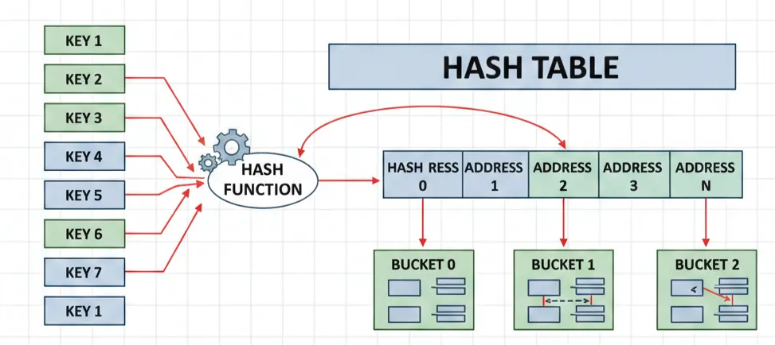

## 🔹 Hash (해시) 개념 정리

### 📌 해시란?

해시는 **해시 함수(Hash Function)** 를 이용해
값을 **인덱스로 변환**하여 데이터를 빠르게 탐색할 수 있게 해주는 자료구조다.

```text
Key → Hash Function → Index → Value
```

---

### 📌 해시의 핵심 특징

**1️⃣ 단방향 접근**

* 키 → 값 : 가능
* 값 → 키 : 불가능

**2️⃣ 빠른 탐색**

* 평균 시간복잡도: **O(1)**
* 코테에서 자주 나오는 신호
  👉 **“탐색이 많이 발생한다” → 해시 고려**

---

### 📌 해시 함수에서 중요한 점

* 결과값은
   **0 이상, 테이블 크기 미만**
* 서로 다른 키가 같은 인덱스로 가는
   **충돌(Collision)을 최소화해야 함**

💡 **실전 코딩 테스트에서는**

* 해시 함수를 직접 구현할 일 ❌
* `unordered_map`, `unordered_set`를
  **정확하게 쓰는 게 핵심**

---

## 🔹 BOJ 3273 — 두 수의 합

 [https://www.acmicpc.net/problem/3273](https://www.acmicpc.net/problem/3273)
 [https://wlals916.tistory.com/16](https://wlals916.tistory.com/16)

###  문제 핵심

* N이 커질수록
  **이중 반복문(O(N²))은 시간 초과**

---

###  관점 전환

❌ “모든 수를 다 더해보자”
✅ “**이 값이 존재하는지만 확인하자**”

```text
arr에 값 a가 있을 때
X - a가 존재하면 하나의 쌍이 된다
```

---

### 📌 해시를 이용한 핵심 아이디어

1️⃣ 수열의 모든 원소를 해시에 기록
2️⃣ 각 값 `i`에 대해 `X - i` 존재 여부 확인
3️⃣ `(i, X-i)`와 `(X-i, i)`가 중복 → **2로 나눔**

```cpp
hash[a] = 1;        // a가 존재함
hash[i] && hash[x-i]
```

---

### 📌 시간복잡도 비교

| 방식      | 시간복잡도    |
| ------- | -------- |
| 모든 쌍 비교 | O(N²)    |
| 해시 사용   | O(N + X) |

👉 **존재 여부 확인 문제에서 해시는 압도적으로 유리**

---

## 🔹 BOJ 14425 — 문자열 집합

 [https://www.acmicpc.net/problem/14425](https://www.acmicpc.net/problem/14425)
 [https://wlals916.tistory.com/17](https://wlals916.tistory.com/17)

###  문제 핵심

> “이 문자열이 집합에 있는지 없는지만 빠르게 확인하자”

---

###  해결 전략

* `unordered_set<string>` 사용
* C++ STL에 문자열 해시 함수 **이미 내장**

```cpp
unordered_set<string> s;

s.insert(str);      // 저장
s.find(str);        // 존재 여부 확인
```

* 존재하면 iterator 반환
* 없으면 `s.end()`

 평균 시간복잡도: **O(1)**

---

### 📌 C++ 해시를 직접 구현할 필요가 없는 이유

**1️. 충돌 처리**

* 직접 구현 → 충돌 로직까지 직접 작성 필요
* STL → 내부적으로 처리

**2️. 성능 & 안정성**

* 다양한 문자열 패턴에서도
  **균등 분산**되도록 설계됨

**시간복잡도**

* 삽입: O(N)
* 탐색: O(M)
* 전체: **O(N + M)**

---

## 🔹 PGS 12981 — 영어 끝말잇기

👉 [https://school.programmers.co.kr/learn/courses/30/lessons/12981](https://school.programmers.co.kr/learn/courses/30/lessons/12981)
👉 [https://wlals916.tistory.com/20](https://wlals916.tistory.com/20)

###  문제 특징

알고리즘 자체는 단순하지만
**처리해야 할 조건이 많음**

체크해야 할 것들:

* 이미 사용한 단어인지
* 끝말잇기 규칙 위반 여부
* 단어 길이가 1인지
* 탈락한 사람 번호 / 차례 계산

---

###  사용한 해결 전략

* `unordered_set<string>`
  → **중복 단어 빠른 검사**
* 단어를 하나씩 순회
* 규칙 위반 순간 인덱스 저장 후 종료

---

###  이번 문제에서 했던 실수들

❌ **1. 중복 체크 누락**

```cpp
used.insert(words[i]);  // 이 줄 빠뜨림
```

→ 중복 단어 검사가 제대로 안 됨

---

❌ **2. 인덱스 계산 실수**

* `% n`, `/ n` 헷갈림
* `+1` 빠뜨림
* **0-based → 문제는 1-based**

 **손으로 직접 케이스 검증 필수**

---

❌ **3. 첫 단어 예외 처리**

```cpp
if (words[0].length() == 1)
```

* 첫 단어도 규칙 위반 가능
* 루프 밖에서 별도 처리 필요

